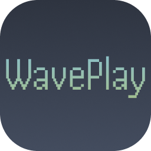

<div align="center">
	<br>
    
	<h1>WavePlay</h1>
	<p>
		<b>A lightweight, customizable, browser-based bytebeat interpreter and visualizer.</b>
	</p>
	<br>
</div>

## Features
- Real-time bytebeat playback with play/pause and tempo control  
- Modular audio effects system (FFT, extensible plugins)  
- Customizable UI themes (Dracula, Gruvbox, Solarized, etc.)  
- Built-in library system for sharing and discovering tracks  
- Fully client-side — no server required for basic usage  
- Lightweight and fast, designed for experimentation and creativity  

---

## Submissions

> ℹ️ All submissions must be sent as a pull request to [this repository](https://github.com/wufhex/waveplay-submissions). Any submission placed on this repository will be ignored and immediately closed.
> ℹ️ Due to GitHub Pages issues, all hardcoded/static URLs in the code must be changed to relative paths. This issue will be fixed soon.

WavePlay supports contributions in three categories:

---

### Bytebeat Libraries

Create a JSON file describing your collection:

```json
{
  "name": "My Bytebeat Library",
  "description": "A collection of experimental bytebeat tracks.",
  "tracks": [
    {
      "name": "Beat #1",
      "author": "you",
      "links": [
        {
          "name": "Original",
          "url": "?d=WAVEPLAY_ENCODED_DATA"
        }
      ]
    }
  ]
}
```

#### Submission process

1. Upload your JSON file to a GitHub repository  
2. Open a pull request to the WavePlay repository  
3. Include the full raw URL to your JSON file  

> ⚠️ Once merged, libraries are immutable due to hash verification. Changes require a new submission.

---

### Effects

Effects extend WavePlay’s visual/audio pipeline.

#### Setup

1. Clone the repo and run WavePlay locally  
2. Create a new file in `js/effects`

#### Template

```js
export class NameEffect {
  constructor(canvas, { getProperty } = {}) {}

  resize(width, height) {}
  init() {}
  
  onThemeUpdate() {}
  update() {
    const fft = this.getProperty?.("fftData");
  }

  destroy() {}
}
```

#### Submission

Open a pull request with your new effect file.

---

### Themes

Themes control the visual styling of WavePlay.

#### Setup

1. Clone and run the project locally  
2. Create a new file in `js/themes`

#### Template

```js
export const NameTheme = {
  "--color-0": "#282a36",
  "--color-1": "#44475a",
  "--color-2": "#6272a4",
  "--color-3": "#f8f8f2",
  "--color-4": "#6272a4",
  "--color-5": "#8be9fd",
  "--color-8": "#bd93f9",
  "--color-9": "#ff79c6",
  "--color-11": "#ff5555",
  "--color-14": "#50fa7b",
  "--color-15": "#1f232a",

  "--font-stack": `-apple-system, BlinkMacSystemFont, "Segoe UI", Roboto, Helvetica, Arial, sans-serif`,
  "--transition-smooth": "all 0.25s cubic-bezier(0.4, 0, 0.2, 1)"
};
```

#### Submission

Submit a pull request with your theme file.

---

## Contribution Guidelines

- Keep changes focused and modular  
- Follow existing code style and structure  
- Test locally before submitting a PR  
- Provide clear descriptions for changes  

## Philosophy

WavePlay is a community driven project focused on shared creativity through bytebeat, effects, and themes.

Its purpose is to grow a rich, evolving ecosystem of user contributed content. The community is the core of the project, everything exists to make contributing, sharing, and exploring new creations as seamless as possible.

## License
WavePlay's source code is free for personal and commercial use under the MIT License. You can use, modify, and integrate it into your engine or tools. Forking and contribution is heavily encouraged!
